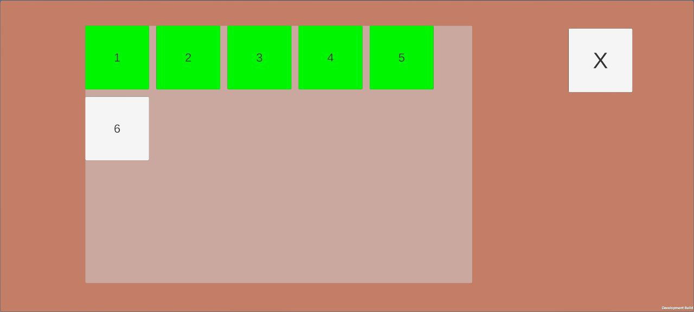
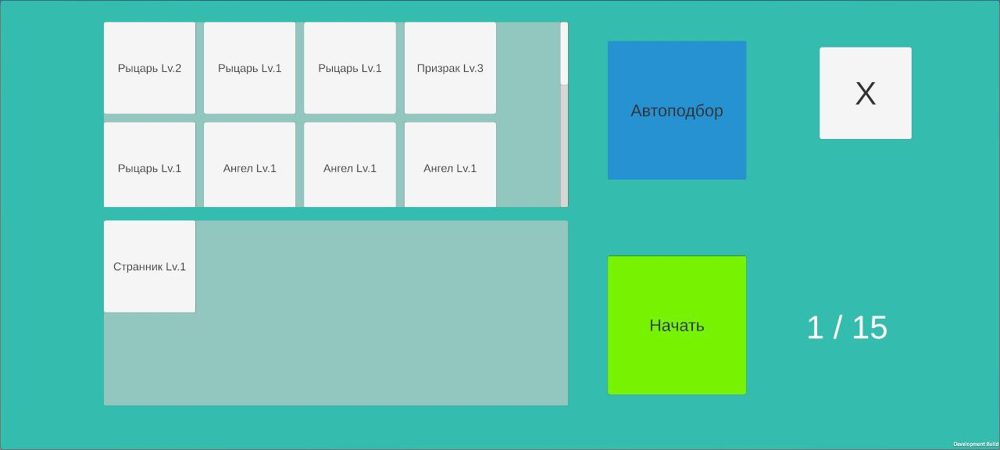
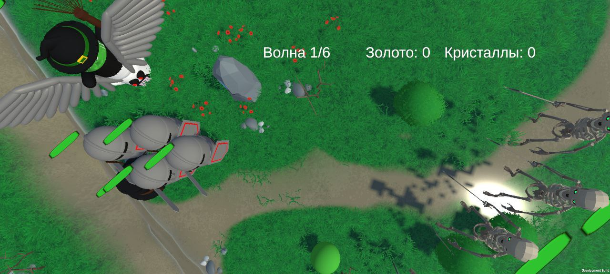
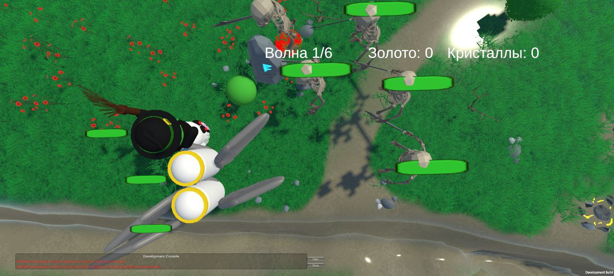

# Битвы

## Как начать бой

Чтобы отправиться в бой, откройте гильдию и выберите режим.

---

## Кампания

Кампания состоит из нескольких уровней, каждый сложнее предыдущего.

---

## Составление отряда

Перед боем составьте отряд из ваших юнитов.  
Доступна функция автоподбора.

---

## Приоритет целей

В бою нажмите на вражеского юнита, чтобы выбрать его как приоритетную цель.

---

## Выбор после волны

После волны необходимо принять решение:

- **Свайп вправо** — продолжение битвы  
- **Свайп влево** — выход с полученными ресурсами  
